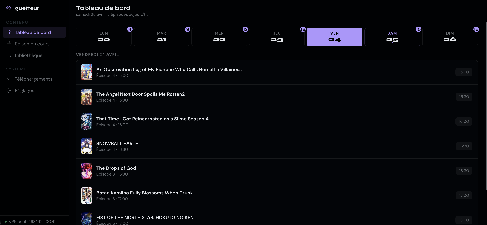
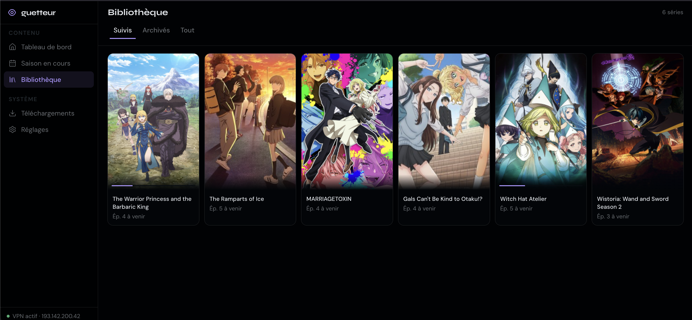
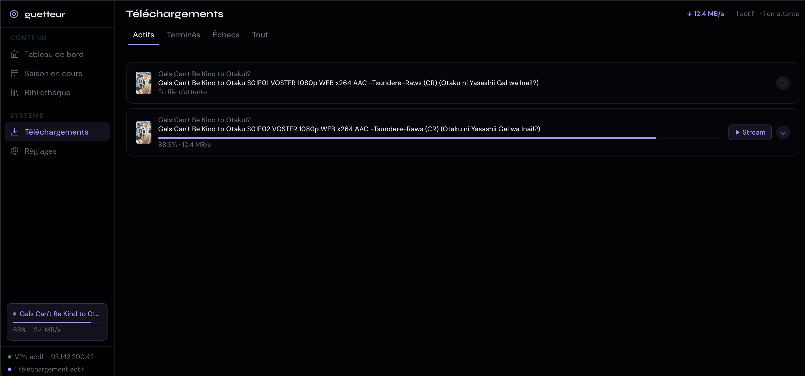
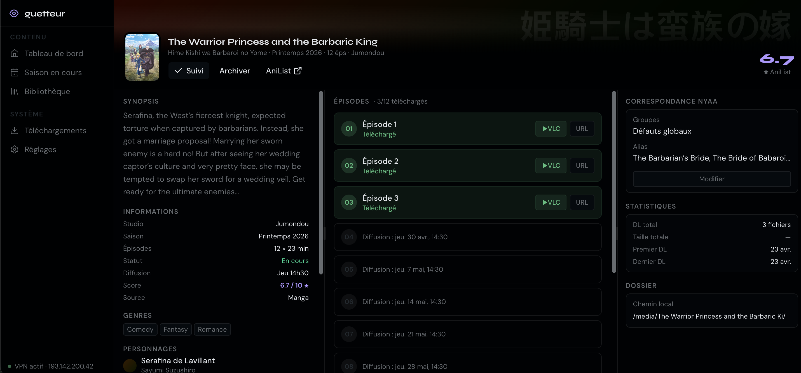
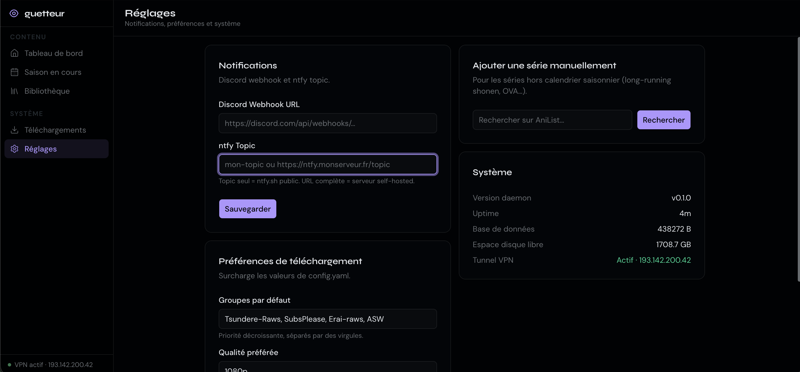

# guetteur

A self-hosted daemon for people who follow weekly anime and are tired of manually checking nyaa every Thursday.

At the start of a season, you open the web UI, follow the 8 shows you'll actually watch, and then forget about it. Every time a new episode drops on nyaa, guetteur picks it up, drops it in your media folder with a Jellyfin-compatible filename, and pings your phone. If you're impatient you can paste the stream URL into VLC before the download even finishes.

Runs on a NAS (built and tested on Ugreen DXP series) behind a NordVPN tunnel via Gluetun. Single binary: Go daemon with an embedded SvelteKit UI.



---

## What it does

- Watches the [AniList](https://anilist.co) seasonal calendar and lets you follow shows from the UI — no account needed, AniList's API is public
- Polls [nyaa.si](https://nyaa.si) RSS feeds every 3 minutes for shows you follow, filtered by release group, quality, and minimum seeders
- Downloads via BitTorrent with sequential piece ordering, so you can start streaming at ~10% downloaded
- Renames and moves completed files using a configurable template (`Show Name/Season 01/Show Name - S01E04 [SubsPlease][1080p].mkv`)
- Sends notifications via Discord webhook and/or ntfy.sh
- When all episodes of a finished series are downloaded, it auto-archives the show so it stops polling

---

## Requirements

- Docker + Docker Compose
- A NordVPN account (for the WireGuard key)
- A NAS or always-on Linux machine with at least a few GB of free space

---

## Setup

### 1. Get your NordVPN WireGuard private key

```sh
docker run --rm -it --cap-add=NET_ADMIN \
  -e PRIVATE_KEY=<your-nordvpn-access-token> \
  ghcr.io/bubuntux/nordlynx sh -c 'wg show nordlynx private-key'
```

The key should be exactly 44 characters.

### 2. Configure

```sh
cp .env.example .env
```

At minimum, fill in:

| Variable | What it is |
|---|---|
| `WIREGUARD_PRIVATE_KEY` | The 44-character key from above |
| `SERVER_COUNTRIES` | Gluetun filter, e.g. `Netherlands,Switzerland` |
| `MEDIA_DIR` | Where finished episodes get downloaded (your Jellyfin library) |

Optional: `DISCORD_WEBHOOK` and `NTFY_TOPIC` for notifications. Leave them empty to disable.

Edit `config.yaml` if you want to change defaults (quality priority, release groups, poll interval, seeding policy). The file is commented and most defaults are sensible.

### 3. Run

```sh
docker compose up -d
```

UI is at `http://<your-nas-ip>:8080`.

---

## Usage

**Following a show:** Go to the Seasonal page, find the show, click Follow. That's it. guetteur will start checking for it on the next poll cycle (within 3 minutes).



**Watching before the download finishes:** On the Downloads page, there's a "Copy stream URL" button next to active downloads. Paste it into VLC. Seeking works via HTTP Range — just don't skip too far ahead of what's downloaded.



**Manual import:** AniList's seasonal page doesn't always include long-running shows (One Piece, etc.). Use the search bar in the UI to import any show by name.

**Overriding release groups:** If you prefer a specific group for one show (say, you want Erai-raws for everything but SubsPlease for one particular series), open the series detail page and set preferred groups there.



---

## Configuration reference

`config.yaml` is user-editable and loaded at startup. A few keys worth knowing:

| Key | Default | Notes |
|---|---|---|
| `poll_interval` | `3m` | How often nyaa is checked per followed series |
| `quality_priority` | `[1080p, 720p]` | First match wins |
| `default_groups` | `[SubsPlease, Erai-raws, ASW]` | Global group whitelist |
| `min_seeders` | `3` | Releases below this are skipped |
| `group_fallback_after` | `12h` | If preferred group hasn't released after X hours, try the next one. Set to `0` to disable. |
| `replace_with_batch` | `true` | When a batch release appears, replace individual episode files |
| `min_free_space_gb` | `20` | Won't start a download if disk is below this |
| `torrent.seed_ratio` | `1.0` | Stop seeding after reaching this ratio |
| `media_filename_template` | `{title}/Season {season:02d}/...` | Jellyfin-compatible by default |

Full reference in [`docs/07-config.md`](./docs/07-config.md).



---

## Caveats

**Title matching is fuzzy, not perfect.** nyaa search returns loosely related results, and guetteur uses jaro-winkler matching to filter them. Ambiguous titles (two shows with similar names in the same season) will occasionally cause false positives. The UI shows which match was used for every queued release so you can see when something's off.

**Streaming mid-download assumes a sane file layout.** If the MKV has its cue header at the end of the file, VLC will stall until enough is downloaded. There's nothing guetteur can do about that — it depends on how the encoder packaged the file.

**It may not auto-rescan.** Jellyfin's rescan behavior depends on your setup. You might need to trigger a library refresh manually after new episodes land.

**No authentication.** This is a single-user tool for a trusted LAN. If you're exposing it outside your network, put Tailscale or Authelia in front of it.

**AniList air times are estimates.** Episodes can drop on nyaa 1–12 hours after the listed time. guetteur just keeps polling — it won't alert you about "late" episodes.

---

## Status

Under active development. The core loop (follow → detect → download → stream → move to media folder) and notification are working. Auto-archive is in progress.

---

## Layout

```
cmd/guetteur/        entry point
internal/
  anilist/           AniList GraphQL client
  nyaa/              RSS fetch + release matching
  parser/            torrent title parsing (anitogo wrapper)
  torrent/           download client + streaming endpoint
  scheduler/         cron jobs, orchestration
  notifier/          Discord + ntfy
  api/               chi router + HTTP handlers
  ui/                embedded SvelteKit build
web/                 SvelteKit source
docs/                detailed specs
```

---

## Not in scope

- Not a Sonarr replacement. It's a simpler, anime-specific, schedule-driven
- Not a media transcoder, it serves raw file bytes, VLC/Jellyfin handle playback
- Not a multi-user app, no auth for now unless I really need it or someone makes a PR
- Anime only, no manga, no live action cause I don't need it and I don't even know if there's manga and live actions on nyaa